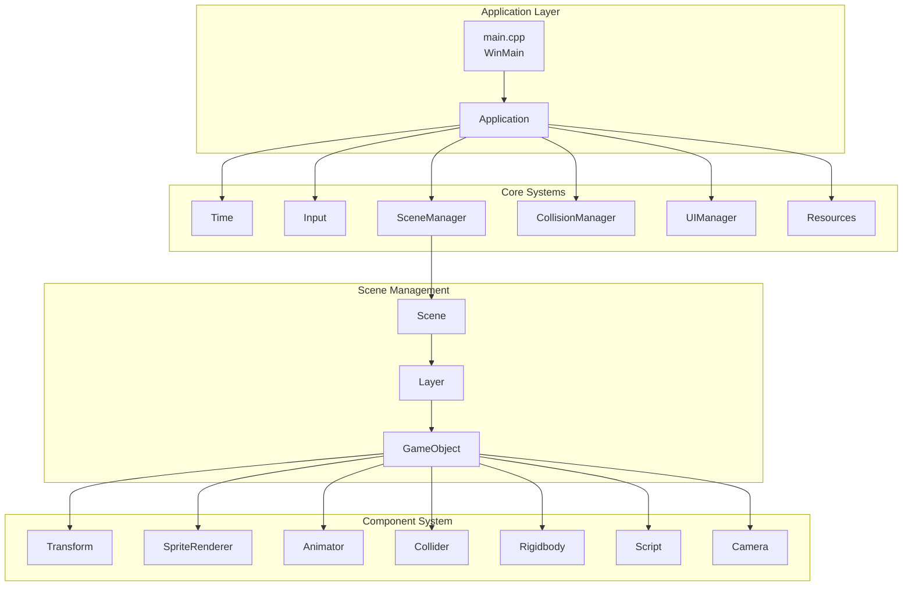
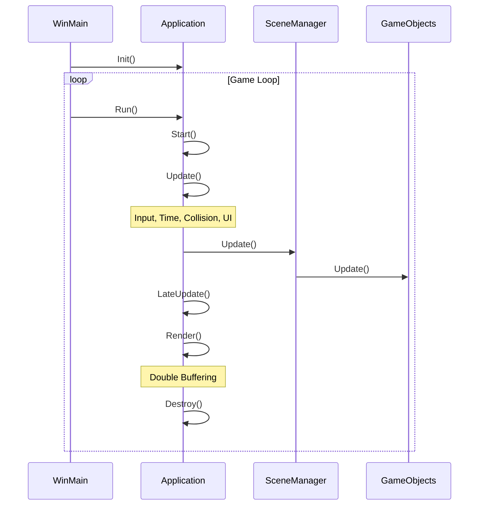
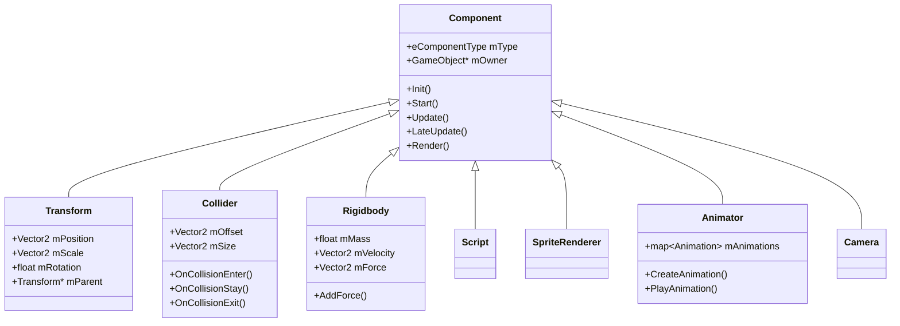
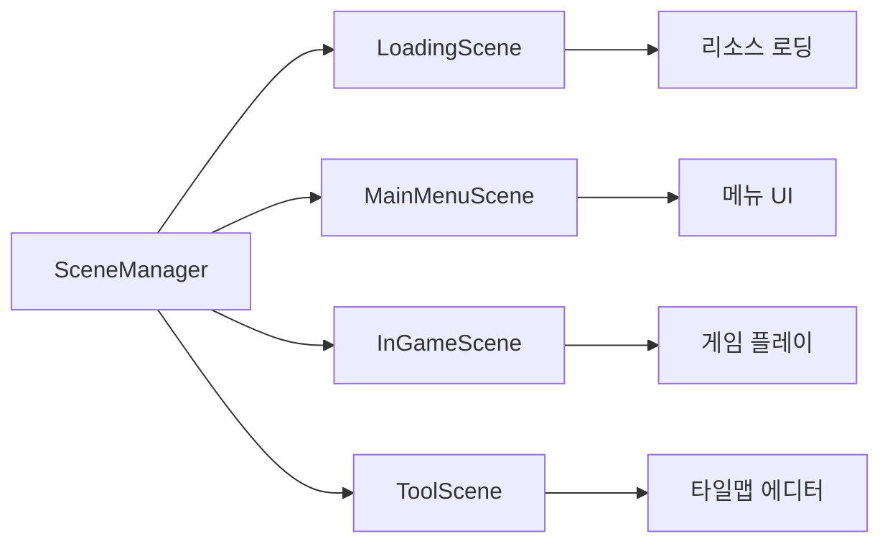
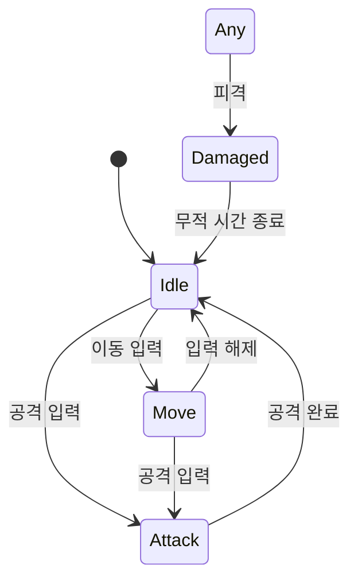

# Windows API 게임 엔진 포트폴리오

## 프로젝트 개요

Unity 게임 엔진의 구조를 모방하여 Windows API와 GDI+를 사용해 직접 구현한 2D 게임 엔진입니다.
**The Binding of Isaac** 스타일의 게임을 개발하기 위해 제작되었습니다.

---

## 프로젝트 구조

```
Editor_Window/
├── Editor_Window/          # 엔진 에디터 (진입점)
│   └── main.cpp           # WinMain, 윈도우 생성, 메시지 루프
├── Engine_SourceCode/      # 엔진 코어 시스템
│   ├── tApplication.*      # 애플리케이션 메인 루프
│   ├── tGameObject.*       # 게임 오브젝트 (Unity의 GameObject)
│   ├── Component.*         # 컴포넌트 기반 시스템
│   ├── Transform.*         # 위치/회전/스케일
│   ├── Scene.*             # 씬 관리
│   ├── SceneManager.*      # 씬 전환 관리
│   └── ...
└── TaeneEngine/            # 게임 로직 (The Binding of Isaac)
    ├── Player.*            # 플레이어 캐릭터
    ├── Enemy.*             # 적 캐릭터
    ├── Bullet.*            # 투사체
    └── ...
```

---

## 엔진 아키텍처



---

## 게임 루프



---

## 기술 스택 및 관련 코드

### 1. Windows API - 윈도우 관리

| 기술 | 설명 | 관련 코드 |
|------|------|-----------|
| `CreateWindowW` | 윈도우 생성 | `Editor_Window/main.cpp:132` |
| `WndProc` | 메시지 처리 | `Editor_Window/main.cpp:199` |
| `PeekMessage` | 게임 루프 | `Editor_Window/main.cpp:69` |
| `GetDC/HDC` | 그래픽 컨텍스트 | `Engine_SourceCode/tApplication.cpp:25` |

### 2. GDI/GDI+ - 2D 렌더링

| 기술 | 설명 | 관련 코드 |
|------|------|-----------|
| `BitBlt` | 비트맵 복사 (더블 버퍼링) | `Engine_SourceCode/tApplication.cpp:151` |
| `CreateCompatibleBitmap` | 백버퍼 생성 | `Engine_SourceCode/tApplication.cpp:156` |
| `Gdiplus::Image` | PNG 이미지 로드 | `Engine_SourceCode/tTexture.h:37` |
| `HBITMAP` | BMP 이미지 처리 | `Engine_SourceCode/tTexture.h:38` |

### 3. 컴포넌트 시스템 (Unity 패턴)

| 기술 | 설명 | 관련 코드 |
|------|------|-----------|
| `AddComponent<T>()` | 컴포넌트 추가 | `Engine_SourceCode/tGameObject.h:36-47` |
| `GetComponent<T>()` | 컴포넌트 검색 | `Engine_SourceCode/tGameObject.h:49-61` |
| `dynamic_cast` | 타입 캐스팅 | `Engine_SourceCode/tGameObject.h:55` |

### 4. 충돌 시스템

| 기술 | 설명 | 관련 코드 |
|------|------|-----------|
| `std::bitset` | 레이어 매트릭스 | `Engine_SourceCode/tCollisionManager.h:38` |
| `CollisionID` | 충돌 쌍 식별 | `Engine_SourceCode/tCollisionManager.h:11-20` |
| `OnCollisionEnter/Stay/Exit` | 충돌 콜백 | `Engine_SourceCode/tCollider.h:18-20` |

### 5. 리소스 관리

| 기술 | 설명 | 관련 코드 |
|------|------|-----------|
| 템플릿 팩토리 | `Resources::Load<T>()` | `Engine_SourceCode/tResources.h:25-44` |
| `std::map` | 리소스 캐싱 | `Engine_SourceCode/tResources.h:66` |
| 키-값 검색 | `Resources::Find<T>()` | `Engine_SourceCode/tResources.h:9-23` |

### 6. 시간 관리

| 기술 | 설명 | 관련 코드 |
|------|------|-----------|
| `QueryPerformanceCounter` | 고해상도 타이머 | `Engine_SourceCode/tTime.h:16-18` |
| `DeltaTime()` | 프레임 간 시간 | `Engine_SourceCode/tTime.h:13` |

### 7. 입력 시스템

| 기술 | 설명 | 관련 코드 |
|------|------|-----------|
| `GetAsyncKeyState` | 키보드 입력 | `Engine_SourceCode/tInput.h:37-39` |
| 키 상태 머신 | Down/Pressed/Up/None | `Engine_SourceCode/tInput.h:6-12` |
| 마우스 위치 | `GetMousePosition()` | `Engine_SourceCode/tInput.h:40` |

### 8. 오브젝트 풀링

| 기술 | 설명 | 관련 코드 |
|------|------|-----------|
| 풀 매니저 | 재사용 가능 객체 | `TaeneEngine/BulletPoolManager.h:13-46` |
| 활성/비활성 상태 | `IsActive()` 체크 | `TaeneEngine/BulletPoolManager.h:29` |

### 9. 애니메이션 시스템

| 기술 | 설명 | 관련 코드 |
|------|------|-----------|
| 스프라이트 시트 | `CreateAnimation()` | `Engine_SourceCode/tAnimator.h:42-48` |
| 이벤트 시스템 | Start/Complete/End | `Engine_SourceCode/tAnimator.h:10-31` |
| `std::function` | 콜백 함수 | `Engine_SourceCode/tAnimator.h:23` |

### 10. 물리 시스템

| 기술 | 설명 | 관련 코드 |
|------|------|-----------|
| Rigidbody | 물리 컴포넌트 | `Engine_SourceCode/tRigidbody.h:6-40` |
| 힘/속도/가속도 | 물리 시뮬레이션 | `Engine_SourceCode/tRigidbody.h:35-38` |
| 중력/마찰 | 물리 속성 | `Engine_SourceCode/tRigidbody.h:30-32` |

---

## 핵심 컴포넌트 타입



---

## 레이어 시스템

게임 오브젝트는 레이어별로 관리되어 렌더링 순서와 충돌 검사를 제어합니다.

```cpp
enum class eLayerType {
    None,
    BackGround1, BackGround2,
    MapTile,
    Enemy,
    Player,
    InteractObject,
    Effect,
    PlayerBody, PlayerHead,
    Bullet,
    Particle,
    ForeGround1, ForeGround2,
    GameSystem,
    Max = 16
};
```

**관련 코드**: `Engine_SourceCode/tEnums.h:17-37`

---

## 씬 구조



---

## 게임 로직 (The Binding of Isaac)

### 플레이어 상태 머신



**관련 코드**: `TaeneEngine/PlayerScript.h:12-20`

### 주요 게임 클래스

| 클래스 | 역할 | 파일 |
|--------|------|------|
| `Player` | 플레이어 캐릭터 | `TaeneEngine/Player.h` |
| `PlayerScript` | 플레이어 로직 | `TaeneEngine/PlayerScript.h` |
| `Enemy` | 적 캐릭터 | `TaeneEngine/Enemy.h` |
| `EnemyScript` | 적 AI | `TaeneEngine/EnemyScript.h` |
| `Bullet` | 투사체 | `TaeneEngine/Bullet.h` |
| `BulletPoolManager` | 탄환 풀링 | `TaeneEngine/BulletPoolManager.h` |

---

## 디자인 패턴 사용

| 패턴 | 적용 위치 | 설명 |
|------|-----------|------|
| **컴포넌트 패턴** | `GameObject`, `Component` | Unity 스타일 컴포넌트 시스템 |
| **싱글톤** | `SceneManager`, `Input`, `Time` | 전역 매니저 클래스들 |
| **팩토리 메서드** | `Resources::Load<T>()` | 템플릿 기반 리소스 생성 |
| **오브젝트 풀** | `BulletPoolManager` | 메모리 재사용 최적화 |
| **상태 패턴** | `PlayerScript::eState` | 캐릭터 상태 관리 |
| **옵저버 패턴** | `Animator::Events` | 애니메이션 이벤트 콜백 |
| **더블 버퍼링** | `Application::Render()` | 화면 깜빡임 방지 |

---

## 메모리 관리

- **메모리 릭 검사**: `_CrtSetDbgFlag()` 사용 (`main.cpp:43`)
- **스마트 포인터 미사용**: 수동 `new`/`delete` 관리
- **DontDestroyOnLoad**: 씬 전환 시 유지되는 객체 (`SceneManager.h:25`)

---

## 빌드 환경

- **IDE**: Visual Studio
- **언어**: C++
- **플랫폼**: Windows (Win32)
- **그래픽**: GDI/GDI+
- **해상도**: 1440x816

---

## 개선 가능 영역

1. **스마트 포인터** 도입으로 메모리 안전성 향상
2. **DirectX** 전환으로 렌더링 성능 향상
3. **사운드 시스템** 추가 (현재 미구현)
4. **직렬화** 시스템으로 씬/프리팹 저장
5. **ECS 아키텍처**로 성능 최적화

---

## 주요 파일 요약

| 카테고리 | 파일 | 라인 | 역할 |
|----------|------|------|------|
| 진입점 | `main.cpp` | 255 | WinMain, 윈도우 생성 |
| 엔진 코어 | `tApplication.cpp` | 163 | 게임 루프 |
| 오브젝트 | `tGameObject.h` | 96 | 게임 오브젝트 |
| 컴포넌트 | `Component.h` | 29 | 컴포넌트 베이스 |
| 씬 관리 | `SceneManager.h` | 41 | 씬 전환 |
| 충돌 | `tCollisionManager.h` | 41 | 충돌 검사 |
| 리소스 | `tResources.h` | 68 | 리소스 관리 |
| 렌더링 | `SpriteRenderer.h` | 29 | 스프라이트 렌더링 |
| 애니메이션 | `tAnimator.h` | 72 | 애니메이션 시스템 |
| 물리 | `tRigidbody.h` | 41 | 물리 시뮬레이션 |
